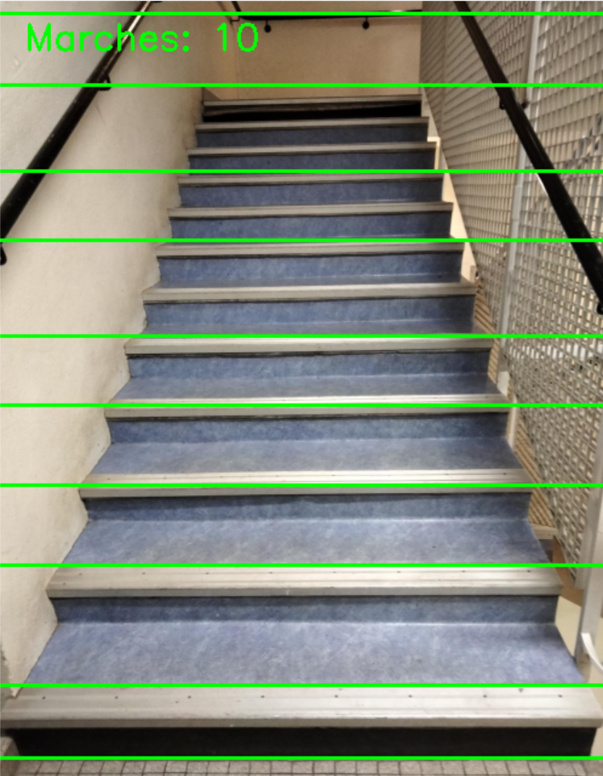

#  Détection et Comptage de Marches d’Escalier
## Groupe 3 : Amine AISSAOUI, Emmanuel Cattan, Abdelkader SOUAYAH

### detectStairs1

Prétraitement : conversion en niveaux de gris et lissage pour réduire le bruit.

Détection des contours : utilisation des filtres Laplacien et Sobel pour extraire les zones de forte variation d’intensité lumineuse.

Binarisation : application d’un seuil d’Otsu pour obtenir une image en noir et blanc mettant en évidence les contours.

Détection des lignes : utilisation de la Transformée de Hough pour identifier les lignes quasi-horizontales correspondant aux marches.

Filtrage des résultats : suppression des doublons et regroupement des lignes proches pour éviter les fausses détections.

### detectStairs2
Chargement et prétraitement de l’image

- L’image est lue et redimensionnée à une largeur fixe de 500 pixels pour standardiser le traitement.
- Elle est convertie en niveaux de gris afin de faciliter l’analyse des contours.
- Un flou gaussien est appliqué pour réduire le bruit et améliorer la détection des bords.

Détection des contours avec Sobel
- Deux filtres de dérivation de Sobel sont appliqués :
  - sobel_x → Met en évidence les contours verticaux
  - sobel_y → Met en évidence les contours horizontaux

- Les deux gradients sont ensuite combinés pour obtenir une image de contours.

Binarisation avec le seuillage d’Otsu
- Un seuil automatique d’Otsu est utilisé pour transformer l’image en noir et blanc, 

Détection des lignes avec la Transformée de Hough
 - Une détection des lignes droites est réalisée pour trouver les marches de l’escalier.
 - Seules les lignes horizontales sont conservées pour éviter les faux positifs.

Fusion des lignes proches
 - Les lignes proches sont fusionnées pour éviter de compter plusieurs fois la même marche.

### detectStairs3
prétraitement de l’image
- Elle est redimensionnée à une largeur de 400 pixels pour faciliter le traitement.
- L'image est ensuite convertie en niveaux de gris 
- Un flou gaussien est appliqué pour réduire les bruits et améliorer la détection des contours.

Détection des bords avec Canny
- Le seuil optimal pour l'algorithme Canny est déterminé à l'aide de la méthode Otsu.
- Canny est utilisé pour détecter les bords dans l'image. Les contours sont représentés en blanc (255) sur un fond noir (0).

Détection des lignes avec la Transformée de Hough
- Transformée de Hough est appliquée pour détecter les lignes dans l’image.
- Seules les lignes horizontales sont considérées pour détecter les marches, en filtrant les autres lignes obliques ou verticales.

Filtrage et fusion des lignes proches
- Les lignes proches les unes des autres sont fusionnées pour éviter les doublons.

Correction de l'orientation de l’image (si nécessaire)
- L'angle dominant des lignes est détecté. Si l'image est inclinée, elle est rotatée pour aligner les marches horizontalement.

| Avant filtrage et fusion des lignes                                    | Apres filtrage et fusion des lignes                                     |
|------------------------------------------------------------------------|-------------------------------------------------------------------------|
|  |  | 
### detectStairs4
Chargement et Prétraitement de l'image
- L'image est d'abord chargée et prétraitée. Elle est convertie en niveaux de gris. Un flou Gaussien est appliqué pour réduire le bruit. 

Détection des Contours
- Les contours dans l'image sont détectés à l'aide de l'algorithme de Canny. Cela permet d'identifier les zones où des transitions fortes de couleur ou de luminosité se produisent, ce qui est souvent le cas autour des marches d'escalier.

Détection des Lignes avec Hough Transform
- Une fois les contours détectés, l'algorithme de transformation de Hough est utilisé pour identifier les lignes dans l'image. 
- Cela permet de localiser les bords et les contours qui peuvent correspondre aux marches des escaliers.

Filtrage et Fusion des Lignes Détectées
- Les lignes détectées par la transformation Hough sont ensuite filtrées pour ne conserver que celles dont la pente est dans une certaine plage (représentant les marches des escaliers). Les lignes proches les unes des autres sont fusionnées pour éviter les doublons et simplifier l'analyse.

Estimation et Correction de l'Orientation
- Un angle dominant est calculé en utilisant les lignes détectées. Si l'orientation de l'image est trop inclinée (supérieur à une certaine valeur seuil), l'image est automatiquement corrigée en appliquant une rotation pour la remettre dans une position plus standard.

### detectStairs5

Redimensionnement de l'image
- L'image est redimensionnée pour avoir une largeur de 500 pixels, tout en conservant ses proportions, à l'aide de la fonction imutils.resize(). 
- Cela permet de faciliter le traitement sans perdre de détails importants dans l'image.

Prétraitement de l'image
- L'image est convertie en niveaux de gris à l'aide de cv2.cvtColor(). Cela permet de simplifier l'image pour les étapes suivantes de détection de contours.
- Un flou gaussien est appliqué avec cv2.GaussianBlur(). Cela réduit le bruit dans l'image et permet de mieux détecter les bords des objets.

- Des filtres de Sobel sont appliqués pour détecter les gradients d'intensité dans les directions horizontales et verticales. 
- Ces informations sont ensuite combinées pour obtenir une image de bords potentiels.

- Un seuillage de type Otsu est appliqué pour obtenir une image binaire, où les bords sont clairement visibles.

Détection de l'angle dominant de l'image
- La transformée de Hough est utilisée pour détecter les lignes présentes dans l'image binaire. Ensuite, les angles des lignes détectées sont calculés pour déterminer l'orientation générale de l'image.
- L'angle médian des lignes détectées est choisi comme étant l'angle dominant de l'image, permettant de déterminer si une rotation est nécessaire pour corriger l'orientation de l'image.

Rotation de l'image (si nécessaire)
- Si l'angle dominant dépasse un seuil donné (ici, 75 degrés), l'image est tournée pour corriger l'orientation à l'aide de la fonction cv2.getRotationMatrix2D() et cv2.warpAffine(). 
- Cela aligne mieux les escaliers pour une détection plus précise.

Détection des escaliers
- Une fois l'image traitée, les contours sont détectés à l'aide de l'algorithme de détection Canny avec les seuils optimaux calculés précédemment.
- La transformée de Hough est ensuite utilisée pour détecter les lignes présentes dans l'image. Ces lignes correspondent souvent aux bords des marches des escaliers.
- Les lignes détectées sont filtrées pour ne conserver que celles qui sont horizontales (représentant les marches), et ces lignes sont ensuite fusionnées si elles sont suffisamment proches les unes des autres.
- Le nombre total de marches est compté en fonction du nombre de lignes horizontales détectées.

### detectStairs6
Redimensionnement de l'image
- L'image est redimensionnée à une largeur de 400 pixels en utilisant imutils.resize(), ce qui permet de faciliter les calculs tout en maintenant les proportions de l'image. 
- Ce redimensionnement est effectué pour améliorer l'efficacité du traitement sans perdre d'informations cruciales.

Prétraitement de l'image
- Conversion en niveaux de gris : Si l'image est en couleur, elle est convertie en niveaux de gris avec cv2.cvtColor().

- Flou gaussien : Un flou gaussien est appliqué à l'image en niveaux de gris pour réduire le bruit et faciliter la détection de bords.

- Détection des gradients avec Sobel : Des filtres de Sobel sont appliqués pour détecter les gradients de l'image dans les directions horizontale et verticale.

- Seuillage : Un seuillage de type Otsu est appliqué pour binariser l'image, permettant de mieux séparer les zones de l'image contenant des bords (comme les marches des escaliers).

Détection de l'angle dominant
- La transformée de Hough est utilisée pour détecter les lignes dans l'image binaire. Ces lignes correspondent souvent aux bords des objets dans l'image, et ici, elles sont utilisées pour identifier l'orientation des escaliers.
- L'angle dominant de l'image est calculé en mesurant les angles des lignes détectées. Si les lignes sont fortement inclinées, cela peut indiquer que l'image doit être corrigée pour une meilleure détection des escaliers.

Rotation de l'image (si nécessaire)
- Si l'angle dominant détecté dépasse un seuil de 75 degrés, l'image est rotatée pour corriger l'orientation. Cela est effectué avec cv2.getRotationMatrix2D() et cv2.warpAffine() qui effectuent une rotation autour du centre de l'image. Cela permet d'aligner correctement les escaliers pour une détection plus précise.

Détection des escaliers
- Les bords de l'image sont détectés en utilisant l'algorithme Canny, avec des seuils optimaux calculés par la méthode d'Otsu.
- Une nouvelle transformée de Hough est appliquée sur les bords détectés pour identifier les lignes dans l'image. Ces lignes peuvent correspondre aux bords des marches des escaliers.
- Les positions verticales des lignes détectées sont extraites et filtrées pour ne conserver que celles qui correspondent à des lignes horizontales, c'est-à-dire celles qui représentent les marches des escaliers.
- Fusion des lignes proches : Si plusieurs lignes sont détectées à des positions proches, elles sont fusionnées afin de ne pas les compter comme des marches distinctes.
- Les marches détectées sont dessinées sur une copie de l'image originale en utilisant cv2.line() avec une couleur rouge.

### findContours

Prétraitement de l’Image
- Chargement et conversion en niveaux de gris
- Application d’un flou gaussien pour réduire le bruit
- Détection des bords avec l’algorithme de Canny

Extraction des Contours
- Détection des contours à l’aide de cv2.findContours
- Création d’un masque pour améliorer la détection des lignes

Détection des Lignes avec Hough Transform
- Utilisation de cv2.HoughLinesP pour extraire les lignes des marches
- Filtrage des lignes pertinentes pour éviter le bruit

Fusion des Lignes Proches
- Les lignes trop proches (moins de 60 pixels) sont fusionnées en une seule
- Cela évite de compter plusieurs fois la même marche

Correction d’Orientation (Homographie)
- Calcul de l’angle médian des lignes détectées
- Rotation de l’image pour aligner les marches horizontalement

### findContoursRectangle1
Chargement et redimensionnement
- L'image est chargée avec OpenCV et redimensionnée pour une meilleure analyse.

Conversion en niveaux de gris et lissage
- L'image est convertie en niveaux de gris.
- Un flou gaussien est appliqué pour réduire le bruit.

Détection des bords avec Canny
- L'algorithme de Canny est utilisé pour extraire les contours les plus significatifs.

Détection des contours et identification des rectangles
- Les contours sont extraits et approximés en polygones.
- Si un contour a quatre sommets, il est considéré comme un rectangle.
- Les petits rectangles sont filtrés pour éviter le bruit.

Comptage des marches détectées
- Les rectangles valides sont comptés et tracés sur l'image.

### compute_average_stairs
La fonction compute_average_stairs permet de calculer le nombre moyen de marches détectées à partir d'une image en utilisant plusieurs méthodes de détection. Elle applique une série de méthodes passées en argument, chacune d'elles retournant une estimation du nombre de marches.

### compute_majority_vote
La fonction compute_majority_vote permet de calculer le vote majoritaire du nombre de marches détectées à partir de plusieurs méthodes de détection. Elle applique chacune des méthodes sur l'image donnée, récupère les résultats, puis retourne la valeur la plus fréquente parmi ces résultats. Si les méthodes retournent des résultats différents, le vote majoritaire permet de choisir le nombre de marches qui apparaît le plus souvent comme prédiction.

### hybrid
La fonction hybrid combine deux approches pour estimer de manière robuste le nombre de marches détectées dans une image : un vote majoritaire et une moyenne filtrée. Cette méthode permet de réduire l'impact des erreurs ou des valeurs aberrantes en utilisant un vote majoritaire pour obtenir une estimation initiale, puis en appliquant un filtrage sur les valeurs trop éloignées de cette estimation. Le résultat final est ensuite calculé en prenant la moyenne des valeurs filtrées.
