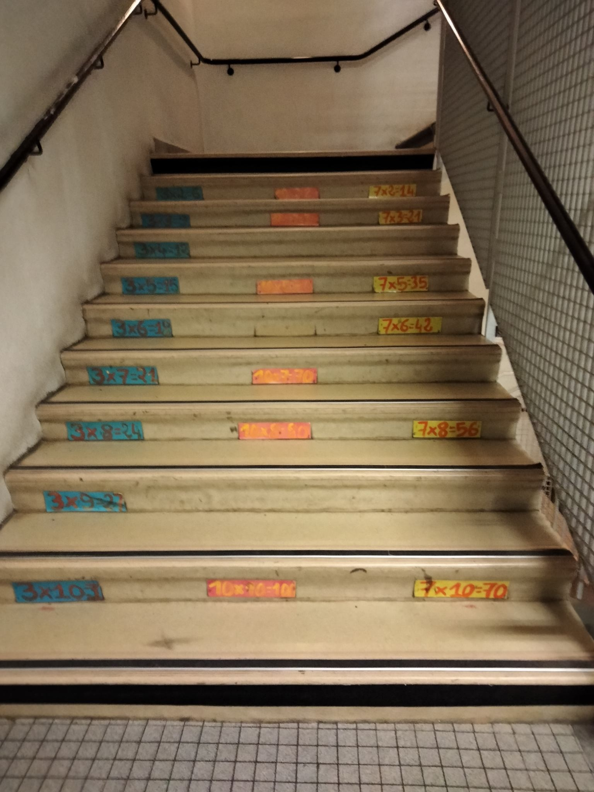
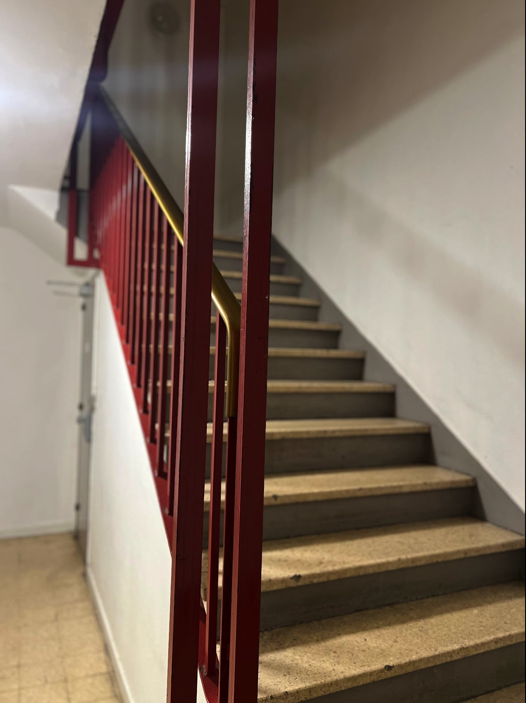
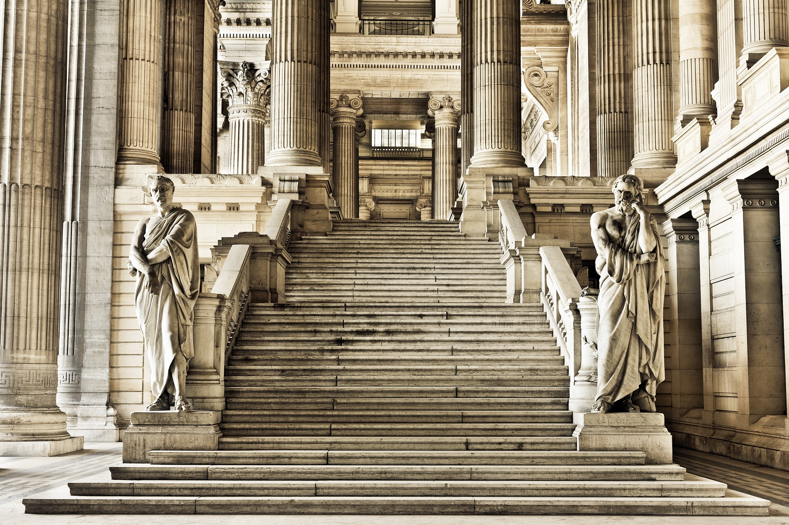

#  Détection et Comptage de Marches d’Escalier
## Groupe 3 : Amine AISSAOUI, Emmanuel Cattan, Abdelkader SOUAYAH
## 📌 Contexte
Ce projet vise à concevoir un programme capable de détecter et compter le nombre de marches d’un escalier.

## 🎯 Objectif
L’objectif principal est de développer une méthode fiable pour :
- Détecter les marches sur une image d’escalier.
- Compter le nombre de marches.
- Évaluer les performances du système sur un jeu de données construit pour l’occasion.
- Identifier les limites de la méthode et proposer des améliorations.

### Exemple d'images

| Image 1 | Image 2 | Image 3 |
|---------|---------|---------|
|  |  |  |

## 📂 Structure du Projet
- **📁 data/** : Contient les images d’escalier avec annotations du nombre de marches.
- **📁 Méthodes/** : Plusieurs approches pour la détection et le comptage des marches (readme inclus)
- **📁 evaluations/** : Résultats des tests et évaluations sur les ensembles train et val (readme inclus)
- **📁 randomForest/** : entrainement de modeles à partir des features qu'on a obtenu via nos méthodes
- **📜 split.py**: divise un ensemble d'images en train (60%), validation (20%) et test (20%) 
- **📜 utils.py**: fonctions implémentés sans opencv (composante connexe, gaussianblur etc )

## 🛠️ Méthodologie
1. **Construction d’un jeu de données**
   - Acquisition d’images de différents escaliers sous divers angles et conditions lumineuses.
   - Annotation manuelle du nombre de marches pour chaque image (vérité terrain).

2. **Détection et Comptage des Marches**
   - Dans le dossier methods/, nous avons défini plusieurs méthodes de détection et de comptage des marches, chacune utilisant des approches différentes ou des ajustements au niveau des parametres pour extraire des caractéristiques à partir des images. 
   - Afin d'améliorer la robustesse des prédictions, nous avons combiné ces différentes méthodes à l'aide, entre autres, de la fonction compute_average_stairs, qui calcule la moyenne des résultats des différentes méthodes pour obtenir une estimation plus fiable. 
   - En complément, nous avons également entraîné plusieurs Random Forest Regressors dans le dossier randomForest afin d'exploiter des modèles d'apprentissage supervisé pour affiner encore davantage les prédictions.
   - plus d'informations dans les readme correspondant

3. **Évaluation des Performances**
   - Comparaison des résultats du programme avec les annotations manuelles.
   - Calcul de métriques comme la MAE.
   - 3.25 sur l'ensemble de test pour la méthode find_Contours_Homographie (voir evaluations/readme pour plus de résultat)

4. **Critique et Amélioration**
   - Le programme fonctionne bien pour détecter les marches dans les images où les escaliers sont bien centrés et clairement visibles. 
   - Il parvient à identifier les contours des marches et à les distinguer avec précision. 
   - Cependant, il rencontre des difficultés lorsque les escaliers présentent une forte inclinaison, ce qui peut fausser la détection des lignes et rendre l’identification des marches moins fiable. 
   - De plus, lorsque les escaliers comportent un grand nombre de marches, le programme peut avoir du mal à différencier correctement chaque marche, entraînant  des erreurs/des détections incomplètes.
   
   - Meilleure correction de perspective : Ajuster plus finement l'homographie pour que les escaliers soient bien alignés avant détection.
   - Amélioration du seuillage et des contours : Tester d'autres techniques que Otsu + Canny, comme des filtres adaptatifs ou des approches basées sur des réseaux neuronaux.
   
## 🚀Utilisation
### 📥 Prérequis
- Python 3.x
- OpenCV
- NumPy
- Matplotlib

### Exécution 
- Dans /evaluations/*
- remplacer 
  >train_directory = "../data/train 

  >ground_truth_json = "../gt.json 
  
   par le chemin de votre dataset et de votre vérité terrain
- ou lancer directement l'execution de la méthode de votre choix depuis l'IDE

   

